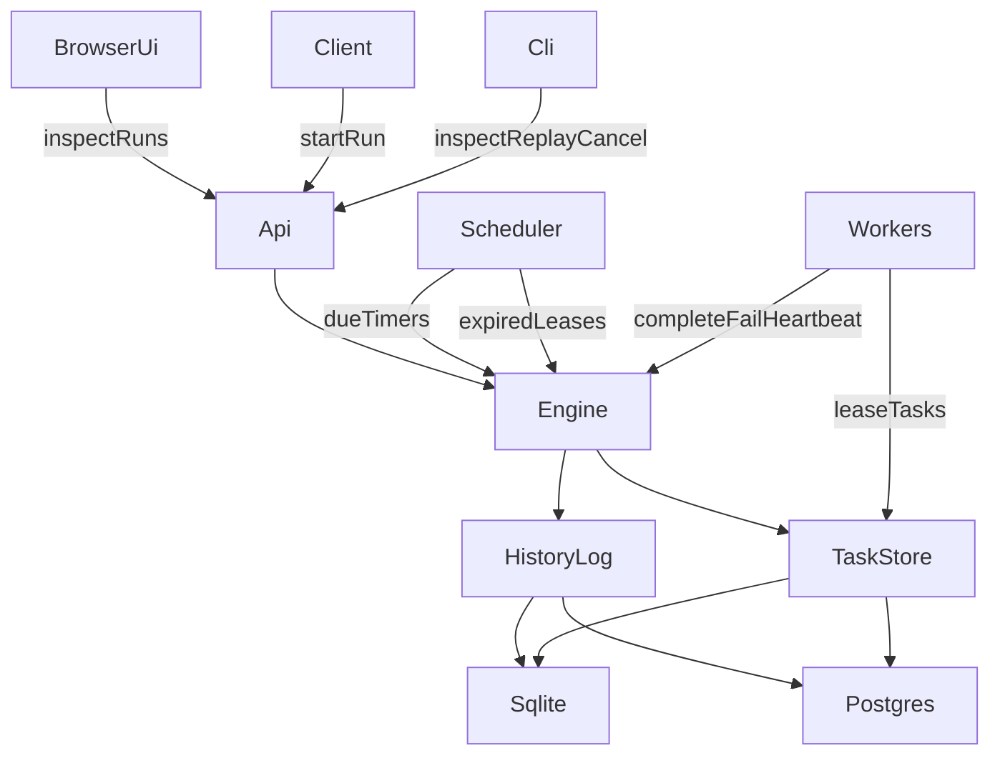

# Orchid Architecture

## Core Shape

## Main Ideas

Orchid is a durable workflow engine. It is not trying to be a full Temporal clone. The architecture is built around a simpler claim:

1. persist every significant state transition
2. rebuild workflow state from that history
3. keep enough denormalized state in durable storage to operate efficiently

`runs` and `tasks` are query-optimized views. `history_events` is the authoritative execution log.

The runtime currently supports two storage adapters:

- SQLite for low-friction local durability and a strong single-binary demo story
- Postgres for more realistic concurrency semantics and a path toward multi-instance coordination

## Workflow Model

Workflows are declarative DAGs defined with `pkg/workflow`. A step can be:

- an activity step executed by a worker
- a timer step executed by the scheduler

Each step may also declare:

- dependencies
- a queue
- retry policy
- timeout
- compensation activity

The engine does not execute arbitrary user workflow code during replay. Instead, it applies recorded events onto a deterministic reducer and derives the resulting run state.

## State Flow

### Start

Starting a workflow creates:

- a `workflow.started` event
- one `task.scheduled` event per root step
- task rows for those root steps

### Worker lease

Workers poll the task store by queue. Leasing a task:

- updates the task row to `leased`
- records a `task.leased` event
- starts heartbeat renewal

On Postgres, leasing uses `FOR UPDATE SKIP LOCKED`, which means multiple workers can safely contend for work without serializing on a single polling loop.

### Completion or failure

When a worker finishes:

- the engine loads the run summary and full history
- replays the event log into memory
- applies the new command
- appends new events transactionally
- updates the run summary and affected task rows

That same path is used for timer firing, retries, cancellation, and compensation.

## Replay

Replay is handled by `internal/engine/reducer.go`. The reducer walks the history in sequence order and reconstructs:

- per-step execution status
- open and completed tasks
- dependency outputs
- cancellation state
- compensation state
- terminal workflow result

`POST /v1/runs/{id}/replay` exposes the replay report so operators can verify that the persisted summary still matches the derived state.

The embedded browser inspector builds on the same API surface. It renders:

- the latest runs
- run summary and tasks
- event history
- replay validation
- a workflow dependency graph derived from replay state

## Compensation

Compensations are scheduled dynamically when a run enters a failure or cancellation path after partial success. Orchid unwinds forward steps in reverse completion order, scheduling one compensation task at a time. This keeps the behavior easy to reason about and makes the event history readable.

## Crash Recovery

Durability comes from two mechanisms:

- every decision is persisted before the engine acknowledges it
- background maintenance scans for due timers and expired task leases

After a restart:

- task rows still exist in SQLite
- history can rebuild run state
- the maintenance loop replays timers and lease recovery
- workers can continue from persisted queue state

## Limits And Extensions

Current design choices:

- single-node maintenance loop even when backed by Postgres
- SQLite as the simplest local backend
- Postgres as the higher-concurrency backend
- queue polling instead of push dispatch
- workflow definitions registered in process

The next serious extension would be introducing leader election or Postgres advisory locking around timer and lease recovery so multiple server instances can coordinate maintenance safely. The event/reducer model is already compatible with that direction.
